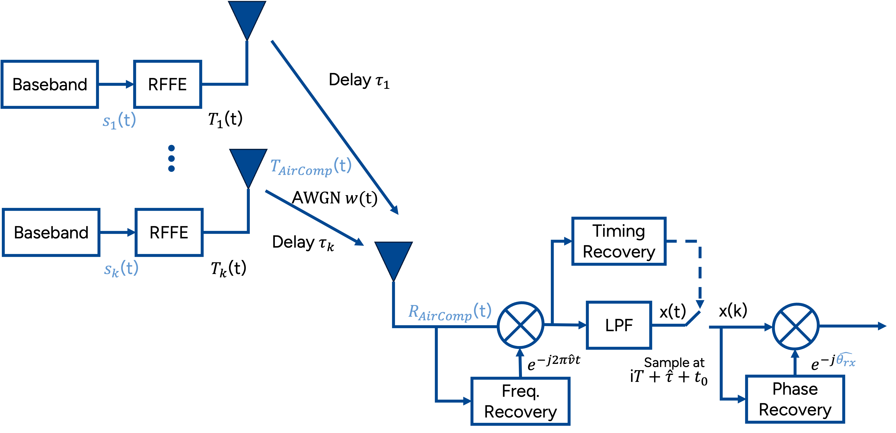

# AirComp_simulation: BPSK over AWGN Channel

This repository contains a simulation of Air Computation (AirComp) using Binary Phase Shift Keying (BPSK) modulation over an Additive White Gaussian Noise (AWGN) channel. This repository contains simulation in ***GNU Radio*** and in ***Python***

## Table of Contents
- [Introduction](#introduction)
- [Mathematics](#Mathematics)
- [Reference](#Reference)

## Introduction
In this project, we simulate one edge server and two edge device using BPSK modulation over an AWGN channel. The simulation computes and plots the Bit Error Rate (BER) against \( E_b/N_0 \) and compares the simulated BER with the theoretical values.

Air Computation (AirComp) exploits the superposition property of the wireless medium to compute functions of distributed data simultaneously over the air.

## Mathematics

### AirComp BPSK with k edge devices
The baseband signal generated by the edge devices are

$
s_k(t) = \sum_{i}^{} a_{i,k} u \left( t-iT_k \right).
$

Where:
- $s_k(t)$ is baseband signal generated by device number k,
- $a_{i,k}$ is message the device intend to send,
- $u(t-iT_{k})$ is the signaling intervals.

The baseband signal is upconverted into RF signal, which is

$
{T_{AirComp}}\left ( t \right ) = \Re\left\{ \sum_{k}^{} s_k(t)e^{j2\pi f_{tx,k}t + j \phi_{txLO,k}}\right \}.
$

Where:
- $T_{AirComp}(t)$ is the total RF waveform,
- $e^{j2\pi f_{tx,k}t}$ is the RF carrier signal,
- $\phi_{txLO,k}$ is the local oscillator phase offset.

The edge server received after the channel model and try to synchronize. The RF waveform received at the receiver is

$
{R_{AirComp}}\left ( t \right ) = \Re\left \{ \sum_{k}^{} s_k(t-\tau_k)e^{j2\pi f_{rx}t + j \theta_{rx}}\right \} + w(t).
$

Where:
- $R_{AirComp}(t)$ is the RF waveform arrived at the receiver,
- $\tau_k$ is the delay each receiver exxperience in the channel,
- $e^{j2\pi f_{rx}t}$ is the RF carrier signal at the receiver,
- $\theta_{rx}$ is the phase offset to recovered,
- $w(t)$ is the AWGN.

The phase that the receiver should recovered is

$\theta_{rx} = - \sum_{k}^{}  (2\pi f_{tx,k} \tau_k + \phi_{txLO,k} ) - \phi_{rxLO}.$

## Reference
[1] Synchronization on PSK Over-the-Air Computation